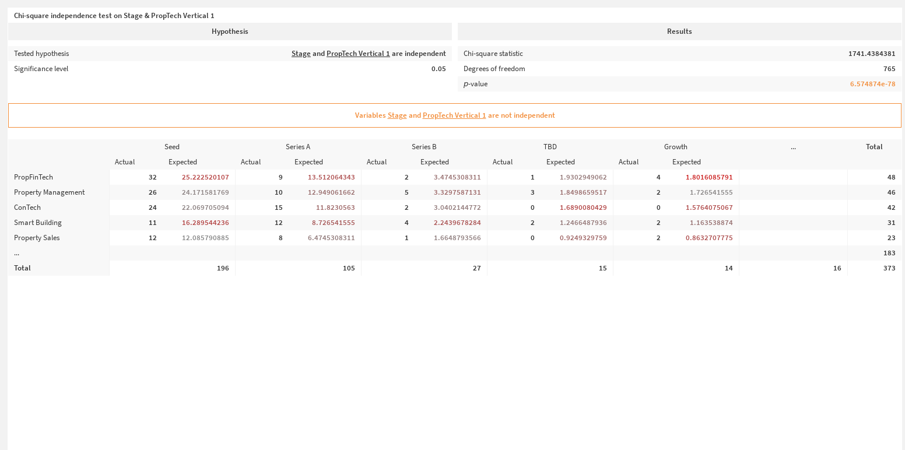
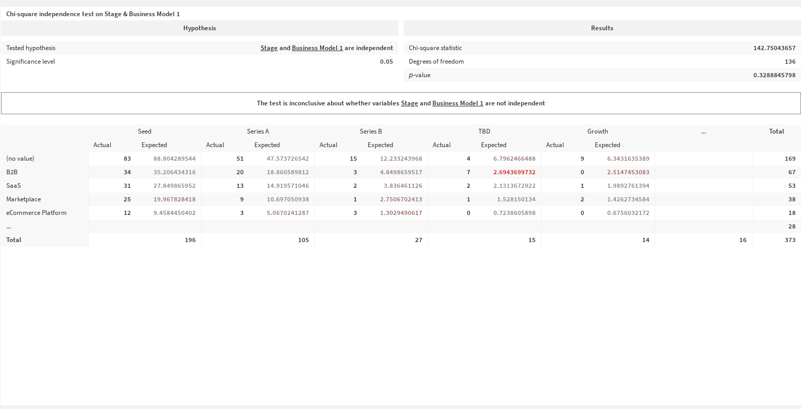
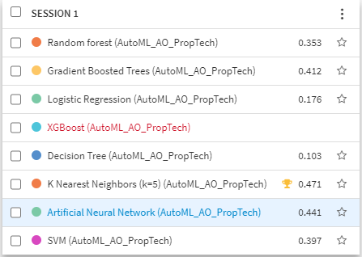
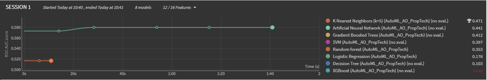
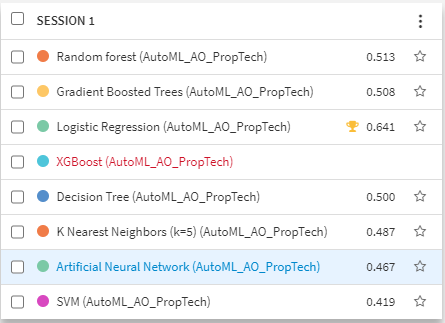
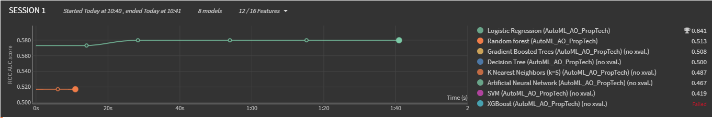

Project Contains
----------------

- analysis_with_code.html
- analysis_with_code.ipynb

Dataset
-------

### Export of Excel sheet

(Used for Visualization Purposes)

- companies_raw.csv

### Continent missing values added to the CSV

(Used for Training Purposes)

- companies_raw_continent.csv

External Files
--------------

(Visualizing PCA Components as Bar Plot)

- visuals.py

(Powerpoint Presentation)

- PropTech Interview Assessment.pptx

[https://www.uh.edu/~bsorense/gra_caus.pdf](https://www.uh.edu/~bsorense/gra_caus.pdf)

```
Referring to [https://www.uh.edu/~bsorense/gra_caus.pdf](https://www.uh.edu/~bsorense/gra_caus.pdf), Granger Causality tests will fail for the given dataset due to non-continuous data in the intervals. 
```

Statistical Tests
-----------------

`Stage` and `PropTech_Vertical1`

**pv1_PropFinTech, pv1_Property Management, pv1_ConTech are correlated to each other**

**As per the presentation Slides, PropTech_Vertical1 (PropFinTech, Property, Management, ConTech) are equally weighed in PCA transformation in First Dimension**



`Stage` and `Business_Model1`

**Marketplace vs B2B vs SaaS are highly correlated**

**As per the Presentation Slides, In PCA, B2B has a higher value in dimensions 1 and 2 indicating they behave differently and is possibly a clustering concern.**



Notice that the pvalues are very less for these comparisons.

**Month_February, Month_March and Month_December are found to be correlated. Also see other correlated columns that are likely to be concordant.**


DEA Problem
-----------


#### HQ analysis


#### Stage analysis


Using TensorFlow Constrained Optimization
-----------------------------------------

### Hinge Loss


### Predictions


### Labels Equating to Predictions


[./reinforcement-learning.ipynb](./reinforcement-learning.ipynb)

# AutoML (using DataIku)
------------------------





